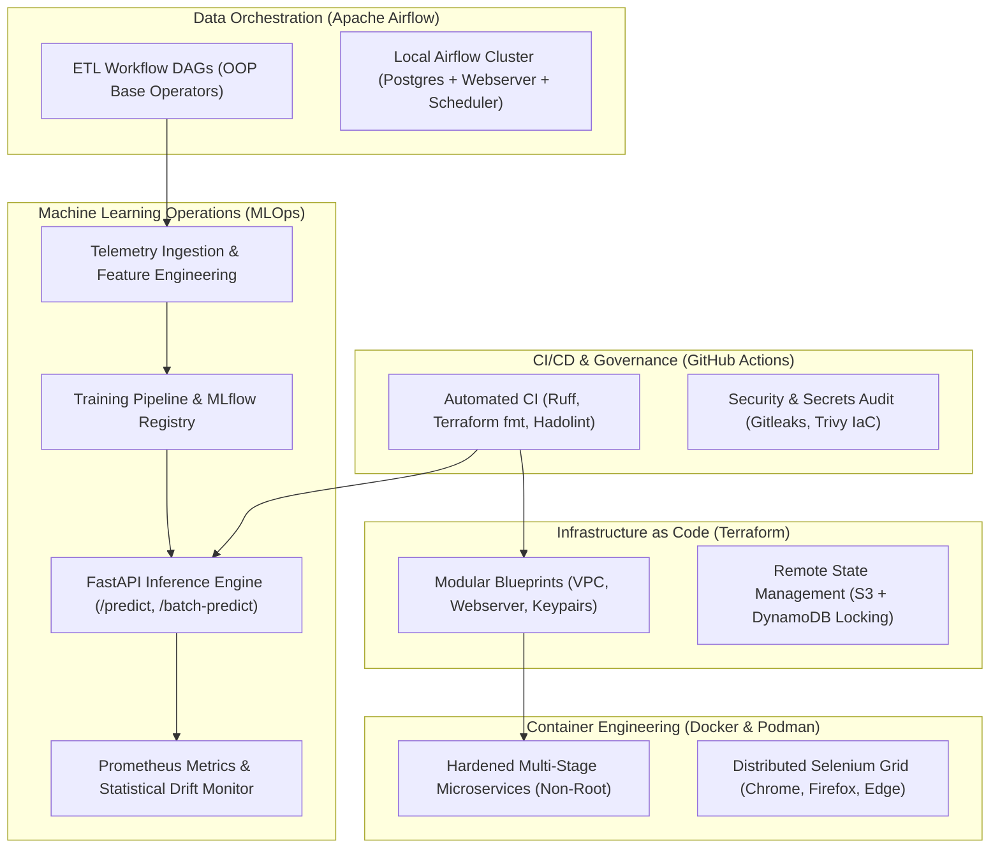

# DevOps & MLOps Production Engineering Reference Architecture

[](https://github.com/sudh29/devops_and_mlops_projects/actions/workflows/ci.yml)
[](https://github.com/sudh29/devops_and_mlops_projects/actions/workflows/security.yml)
[](https://www.python.org/)
[](https://www.terraform.io/)
[](https://podman.io/)
[](https://mlflow.org/)
[](LICENSE)

An enterprise-ready repository showcasing end-to-end patterns in **Infrastructure as Code (Terraform)**, **Container Hardening (Docker & Podman)**, **Data Workflow Orchestration (Apache Airflow)**, and a production **MLOps Lifecycle Platform** (MLflow, FastAPI, Prometheus, and Statistical Drift Detection).

---

## 🏛️ System Architecture



---

## 📦 Project Modules

### 1. [MLOps Lifecycle Platform](./mlops/README.md)
* **Domain**: Industrial Sensor Telemetry & Predictive Equipment Failure.
* **Feature Engineering**: Thermodynamic differentials, mechanical power calculations, strain indices.
* **Experiment Tracking**: Integrated with **MLflow** and S3-compatible **MinIO** storage.
* **Serving Microservice**: Low-latency **FastAPI** service with Pydantic v2 input schemas.
* **Observability**: Live Prometheus scrape endpoint at `/metrics`.
* **Drift Detection**: Two-sample Kolmogorov-Smirnov (KS) statistical drift detector with JSON audit reports.

### 2. [Terraform Infrastructure as Code](./terraform/README.md)
* **14 Progressive Projects**: Progression from basic HCL syntax and JSON configurations to dynamic blocks, maps, loops, and provider integrations.
* **Modular Reusability**: Reusable EC2 webserver module with keypair abstractions ([`project13`](./terraform/project13)).
* **State Management**: Production remote state backend pattern using AWS S3 and DynamoDB state locking ([`project14`](./terraform/project14)).

### 3. [Docker & Podman Containers](./docker_and_podman/README.md)
* **`01_hello`**: Minimalist Python containerization.
* **`02_flask`**: Multi-stage, non-root microservice with unprivileged `appuser` and container healthchecks.
* **`03_selenium` & `04_selenium_python`**: Headless browser automation with explicit `WebDriverWait` and assertions.
* **`05_selenium_grid`**: Scalable multi-browser Selenium Grid 4 cluster running Chrome, Firefox, and Edge via Docker Compose.

### 4. [Apache Airflow Data Orchestration](./apache_airflow/README.md)
* **Object-Oriented DAG Design**: Extensible `ETLBaseOperator` and `ETLDag` encapsulation.
* **Unit Testing Suite**: Isolated testing of task execution and DAG graph dependencies.
* **One-Click Local Stack**: Full PostgreSQL + Webserver + Scheduler setup via Docker Compose.

### 5. Automation, CI/CD & Security
* **Automated CI**: GitHub Actions workflow validating Python code style (Ruff), Terraform formatting (`terraform fmt`), and container builds.
* **Security Scanning**: Automated secret detection (Gitleaks) and IaC vulnerability auditing (Trivy).
* **Pre-Commit Framework**: Standardized `.pre-commit-config.yaml` for pre-push validation.

---

## ⚡ Quickstart

A unified [`Makefile`](./Makefile) is provided for common development and testing tasks:

```bash
# Display help and available tasks
make help

# Format Terraform and Python code
make fmt

# Run linters and style checks
make lint

# Generate MLOps industrial sensor dataset
make data

# Run statistical data drift analysis
make drift

# Execute test suites (Airflow DAGs + MLOps)
make test
```

### Launching Local Docker Stacks

```bash
# Launch full MLOps Stack (MinIO + MLflow + FastAPI + Prometheus)
make up-mlops

# Launch Apache Airflow Stack
make up-airflow

# Launch Distributed Selenium Grid
make up-selenium
```

---

## 📋 Technology Stack

| Category | Tools & Libraries |
| :--- | :--- |
| **Infrastructure as Code** | Terraform 1.9+, AWS Provider, GitHub Provider |
| **Containerization** | Docker, Podman, Docker Compose v2 |
| **MLOps & AI** | Scikit-learn, MLflow, FastAPI, Pydantic v2, MinIO, SciPy |
| **Orchestration** | Apache Airflow 2.10, PostgreSQL |
| **Observability & Testing** | Prometheus, Pytest, Selenium 4, KS-Test Drift Detection |
| **CI/CD & Security** | GitHub Actions, Ruff, Pre-Commit, Gitleaks, Trivy |

---

## 📄 License

This repository is licensed under the [MIT License](./LICENSE).
