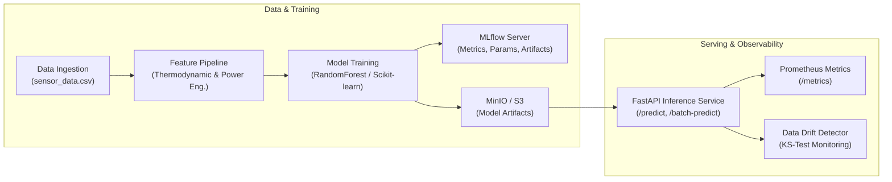

# Production MLOps Pipeline: Predictive Maintenance

This module implements a production-grade End-to-End Machine Learning Operations (MLOps) system for industrial sensor telemetry and equipment failure prediction.

---

## Architecture Overview



---

## Key Features

1. **Feature Engineering**: Derives domain-specific thermodynamic differentials (`temp_diff`), mechanical power outputs (`power_kw`), and strain indices.
2. **Experiment Tracking & Model Registry**: Integrated with **MLflow** and S3-compatible **MinIO** storage.
3. **Low-Latency Inference Microservice**: Built with **FastAPI**, validating payloads via **Pydantic** v2 models.
4. **Production Observability**: Live Prometheus counters and latency histograms exposed at `/metrics`.
5. **Statistical Drift Detection**: Two-sample Kolmogorov-Smirnov (KS) test alerting to distribution shifts and sensor degradation.
6. **Containerized Deployment**: Multi-stage Docker build running under an unprivileged user (`mluser`).

---

## Directory Structure

```
mlops/
├── docker-compose.mlops.yml    # Full MLOps stack (MinIO, MLflow, FastAPI, Prometheus)
├── prometheus.yml             # Prometheus scrape configuration
├── pyproject.toml             # Project dependency specification
├── requirements.txt           # Pinned dependencies
├── data/
│   ├── generate_dataset.py    # Industrial telemetry synthesizer
│   └── sensor_data.csv        # Baseline dataset
├── src/
│   ├── config.py              # Pydantic BaseSettings
│   └── pipeline.py            # Feature engineering & ML pipeline builder
├── train.py                   # Model training and MLflow artifact logger
├── serving/
│   ├── Dockerfile             # Multi-stage production container
│   ├── app.py                 # FastAPI inference service
│   └── schemas.py             # Request/response schemas
├── monitoring/
│   └── drift_monitor.py       # Two-sample KS-test drift detector
└── tests/
    ├── test_pipeline.py       # Feature pipeline unit tests
    └── test_api.py            # API contract integration tests
```

---

## Quickstart & Local Execution

### 1. Install Dependencies

```bash
cd mlops
pip install -r requirements.txt
```

### 2. Run Model Training

```bash
python train.py
```

Output:
```text
[1/5] Preparing training dataset...
[2/5] Training data: 4000 samples, Test: 1000 samples
[3/5] Fitting pipeline...
[4/5] Evaluating performance...
  - accuracy: 0.9650
  - precision: 0.9120
  - recall: 0.8840
  - f1_score: 0.8978
  - roc_auc: 0.9854
[5/5] Saving model artifact...
[PASS] Model artifact saved to: models/model_pipeline.joblib
```

### 3. Launch Local Inference Server

```bash
uvicorn serving.app:app --host 0.0.0.0 --port 8000 --reload
```

- **Interactive Swagger Docs**: [http://localhost:8000/docs](http://localhost:8000/docs)
- **Health Check**: [http://localhost:8000/health](http://localhost:8000/health)
- **Prometheus Metrics**: [http://localhost:8000/metrics](http://localhost:8000/metrics)

### 4. Test Single-Sample Inference

```bash
curl -X POST "http://localhost:8000/predict" \
     -H "Content-Type: application/json" \
     -d '{
       "air_temperature_k": 300.5,
       "process_temperature_k": 310.2,
       "rotational_speed_rpm": 1520.0,
       "torque_nm": 42.5,
       "tool_wear_min": 120.0
     }'
```

Response:
```json
{
  "prediction": 0,
  "probability": 0.0421,
  "status": "NORMAL",
  "model_version": "1.0.0"
}
```

### 5. Run Statistical Drift Detection

```bash
python monitoring/drift_monitor.py
```

Generates `monitoring/drift_report.json` with p-values and KS-statistics for every feature.

### 6. Full Docker Compose Deployment

Start the complete stack (MinIO + MLflow + Inference API + Prometheus):

```bash
docker compose -f docker-compose.mlops.yml up -d
```

---

## Automated Testing

Run the unit and integration tests:

```bash
pytest -v tests/
```
